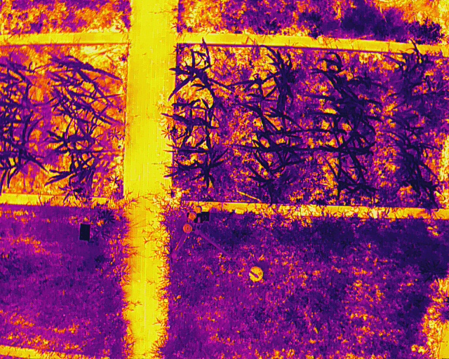
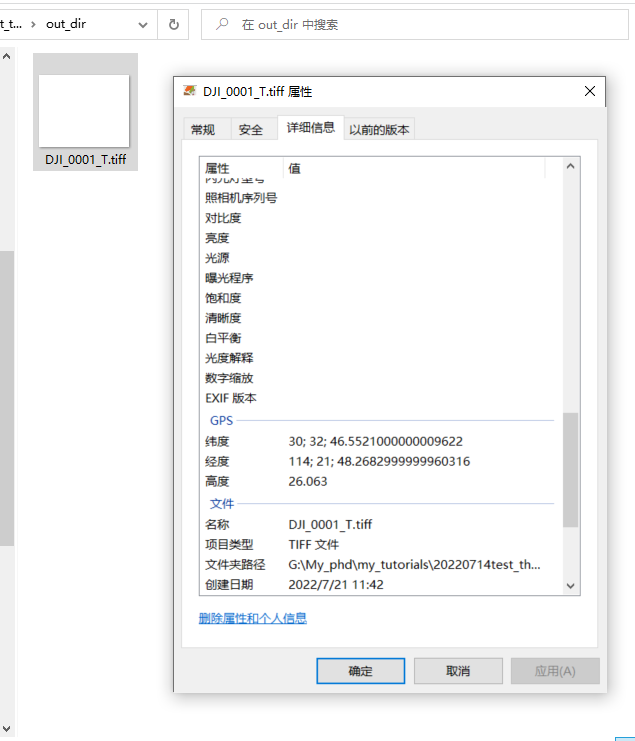
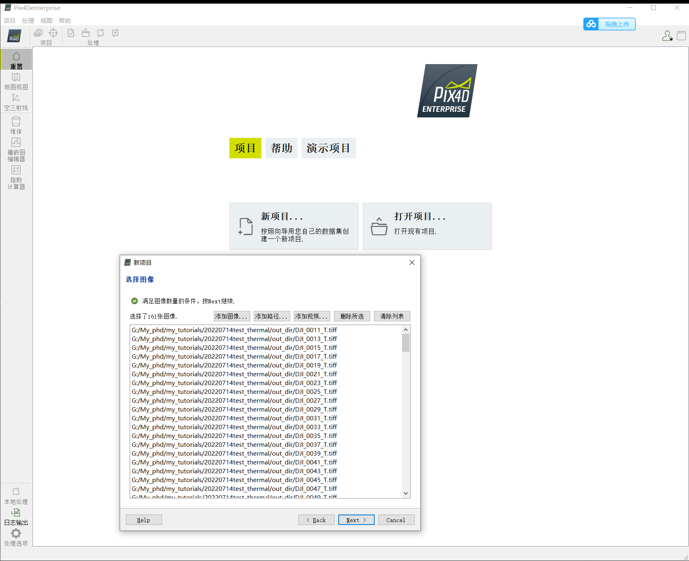
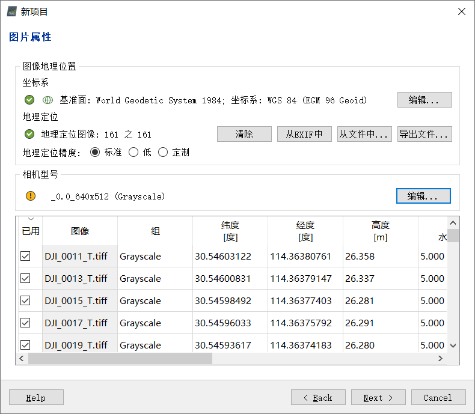
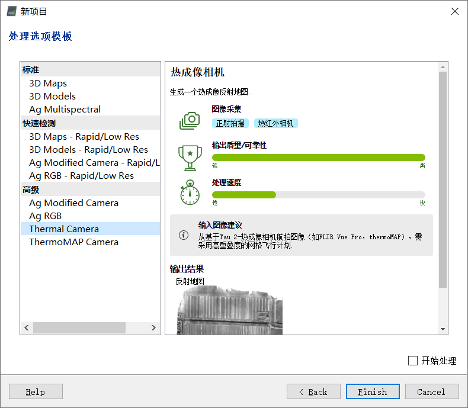
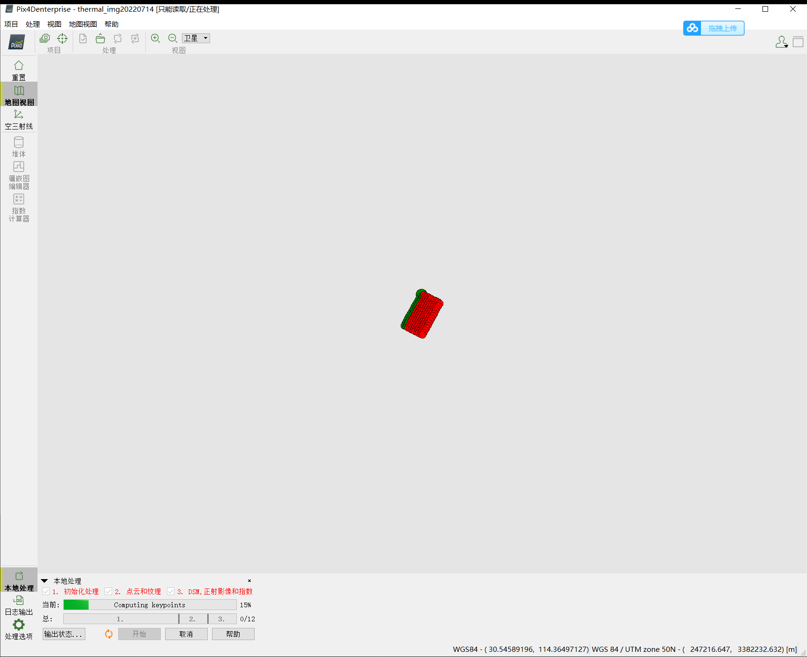
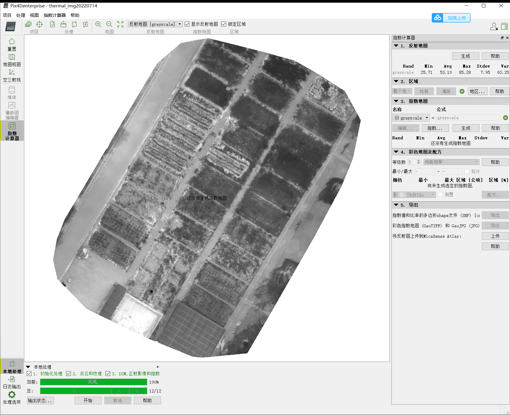
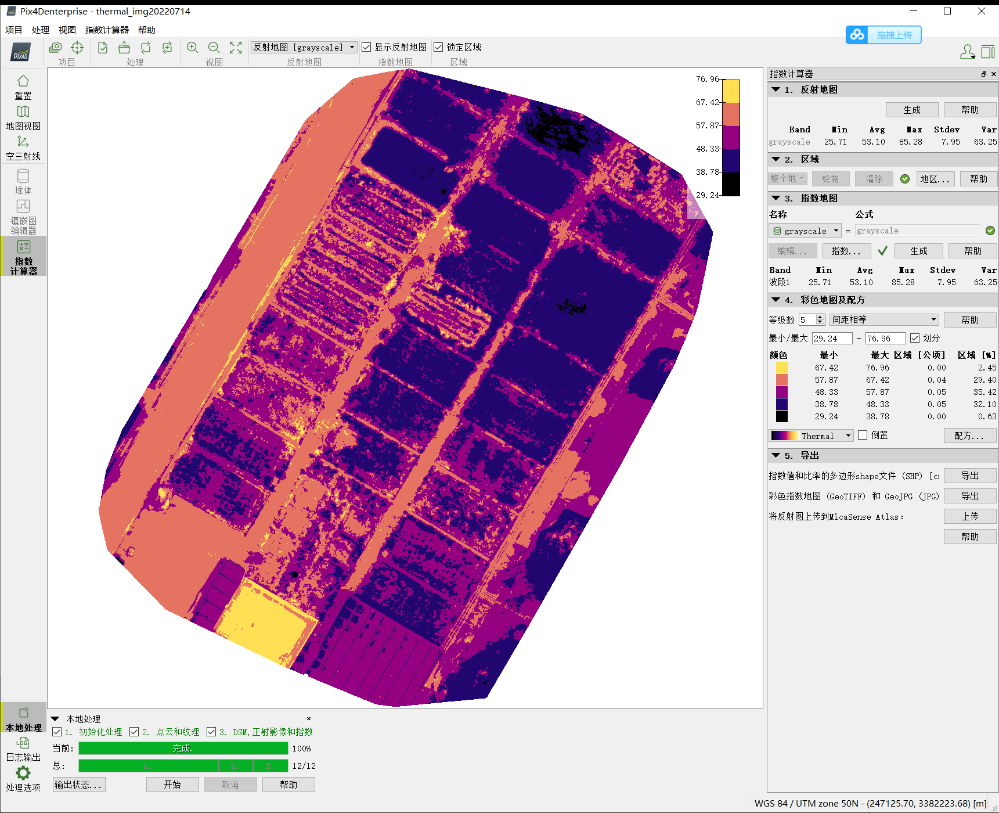
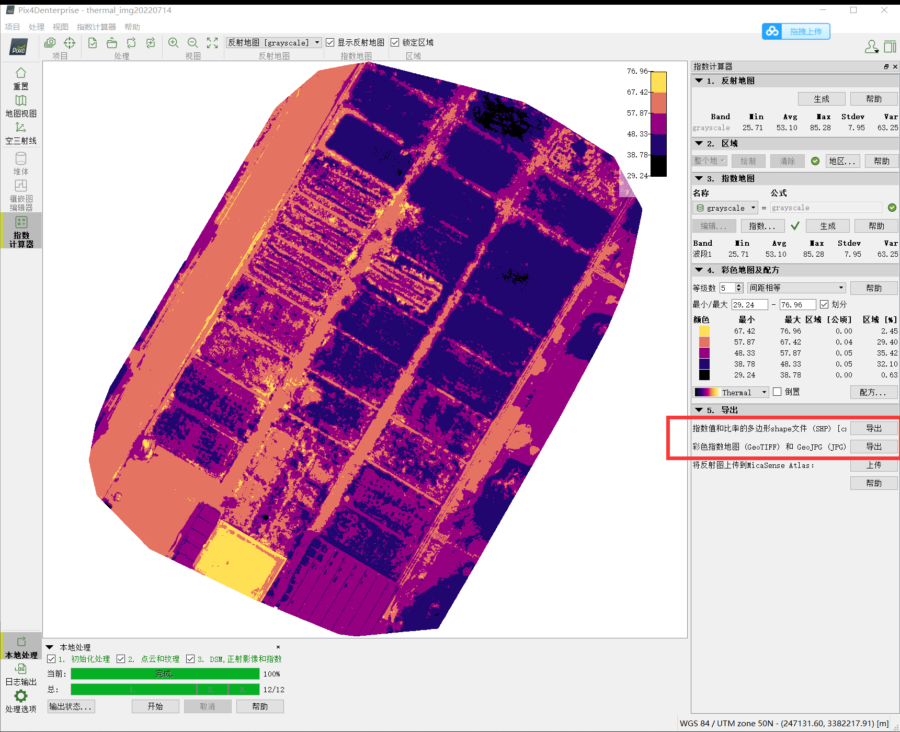

# DJI 热红外jpg转tiff脚本使用方法
可能支持的型号有：
- 禅思 H20N
- 禅思 Zenmuse XT S
- 禅思 Zenmuse H20 系列
- 经纬 M30 系列
- 御 2 行业进阶版
- DJI Mavic 3 行业系列


## 使用环境
测试环境为Windows10 64位

## 依赖包

python==3.7

numpy==1.17.0  

piexif==1.1.3   

pillow==9.1.1  

## 使用方法
```python
    # 输入和输出目录
    input_dir = "input_dir"
    temp_dir = "temp_dir"
    output_dir = 'out_dir'
```
`input_dir`为拍摄的红外相片的文件夹

`temp_dir`为存储数据用的临时文件夹 

`output_dir`为保存tiff图像结果的文件夹 

## 参数设置

其中参数的意义是：
`distance`：拍摄距离
`humidity`：空气湿度
`emissivity`：发射率
`reflection`：反射温度
先将要合成的图像复制进`input_dir`文件夹，然后运行`main.py`即可。

```python
run(input_dir, output_dir, distance=10, humidity=70,emissivity=0.95,reflection=40)
```


# 使用效果

## 采集图像

我这里使用的**御2行业进阶版**基于航线规划拍摄的热红外图像



## 将jpg图像转化为tiff格式

转化完成后，可以发现图像的**位置信息**能够得以保留



## 使用pix4D对tiff图像进行合成

[下载链接](链接：https://pan.baidu.com/s/1jaFxEL8qXFJdGtdeu9F4iw?pwd=v6xk)

添加图像



可以看到，导入的图像有位置信息，但是没有相机型号（一个小缺点）



选择thermal camera



开始处理



最后即可得到温度值的图



也可生成指数图



最后根据需要生成相应的shp文件或Geotiff文件


